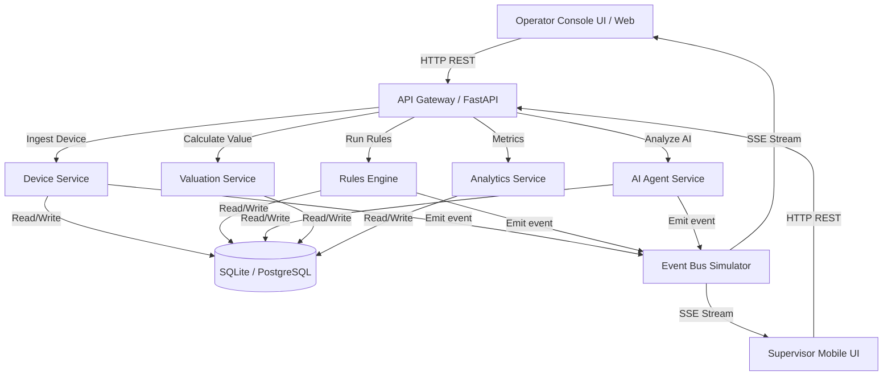
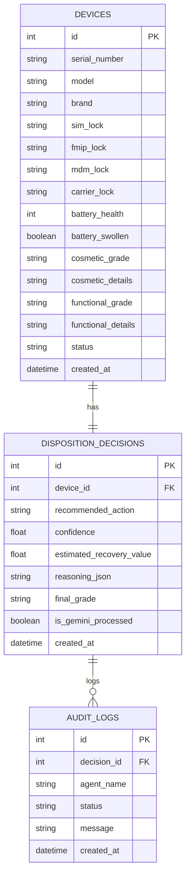

# Architecture Specification: ReturnsOS

This document details the architectural layout, database design, and event-driven communication protocols for **ReturnsOS**.

## System Overview

ReturnsOS is built as a multi-service architecture simulating a production environment with an Event Bus (Kafka/RabbitMQ), a relational database (PostgreSQL/SQLite), and an AI-agent layer.



---

## Service Descriptions

1. **Device Service**: Handles the intake, state management, and final disposition records of returned devices.
2. **Rules Engine**: Processes the step-by-step questionnaire answers. Implements the **Lowest-Grade Rule** and checks for immediate exceptions (locks, swollen batteries).
3. **AI Decision Service**: A multi-agent system executing 4 key roles:
   * **Condition Assessment Agent**: Checks diagnostic results.
   * **Recovery Valuation Agent**: Calculates repair costs vs market value.
   * **Disposition Recommendation Agent**: Blends business rules and findings to propose a path.
   * **Audit Agent**: Audits the recommendation against safety and operational constraints.
4. **Valuation Service**: Manages financial calculations. Establishes the estimated recovery value based on the final grade and repair costs.
5. **Analytics Service**: Computes metrics like Recovery Value Percentage (RVP) and processing speeds.

---

## Database Schema (SQLite)

We use SQLite for the local MVP, mapping directly to PostgreSQL in production.



---

## Simulated Event-Driven Topologies (Kafka)

To showcase system-thinking, we simulate a Kafka broker. Every time a device is processed, events are fired into topics and streamed to the UI via Server-Sent Events (SSE).

### 1. Topic: `device.received`
Fired when the operator creates the initial record.
```json
{
  "event_id": "evt_01H2X...",
  "topic": "device.received",
  "timestamp": "2026-06-09T14:54:04Z",
  "data": {
    "device_id": 101,
    "serial_number": "IMEI987654321",
    "model": "iPhone 14 Pro",
    "brand": "Apple"
  }
}
```

### 2. Topic: `testing.completed`
Fired after the questionnaire evaluations are compiled.
```json
{
  "event_id": "evt_01H2X...",
  "topic": "testing.completed",
  "timestamp": "2026-06-09T14:54:08Z",
  "data": {
    "device_id": 101,
    "cosmetic_grade": "B",
    "functional_grade": "C",
    "battery_health": 82,
    "battery_swollen": false,
    "locks": {
      "sim_lock": "UNLOCKED",
      "fmip_lock": "UNLOCKED",
      "mdm_lock": "UNLOCKED",
      "carrier_lock": "UNLOCKED"
    }
  }
}
```

### 3. Topic: `valuation.updated`
Fired when the Valuation Service computes market pricing and repair costs.
```json
{
  "event_id": "evt_01H2X...",
  "topic": "valuation.updated",
  "timestamp": "2026-06-09T14:54:10Z",
  "data": {
    "device_id": 101,
    "market_value": 550.00,
    "est_repair_cost": 120.00,
    "est_recovery_value": 430.00
  }
}
```

### 4. Topic: `decision.pending`
Fired when the AI Agents evaluate disposition paths.
```json
{
  "event_id": "evt_01H2X...",
  "topic": "decision.pending",
  "timestamp": "2026-06-09T14:54:12Z",
  "data": {
    "device_id": 101,
    "proposed_action": "REPAIR",
    "confidence": 0.94,
    "agent_reasoning": {
      "condition_assessment": "Device has functional C and cosmetic B, requires Screen Repair.",
      "valuation_assessment": "Market value is $550, repair is $120. Estimated recovery is $430 (78% RVP). Highly profitable."
    }
  }
}
```

### 5. Topic: `decision.audited`
Fired when the Audit Agent finishes verification and saves the final disposition.
```json
{
  "event_id": "evt_01H2X...",
  "topic": "decision.audited",
  "timestamp": "2026-06-09T14:54:14Z",
  "data": {
    "device_id": 101,
    "final_action": "REPAIR",
    "final_grade": "C",
    "audited": true,
    "audit_status": "APPROVED",
    "audit_notes": "Enforced Lowest-Grade rule. No swollen battery or locks flagged. Safe to proceed to Repair queue."
  }
}
```
