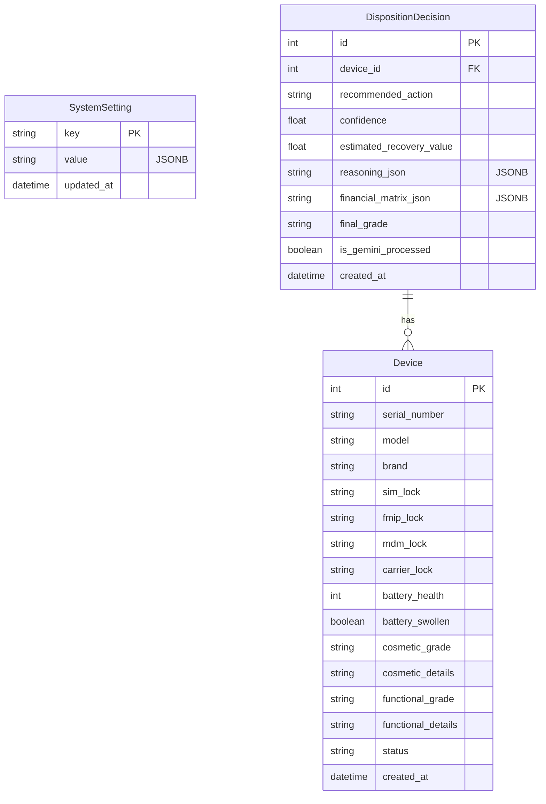

# Data Model

## Entity Relationship Diagram

## JSONB Fields
We use JSON stringified text (effectively JSONB in Postgres) for rules and reasoning:
1. `SystemSetting.value`: Stores dynamic policy objects like base prices and multipliers.
2. `DispositionDecision.reasoning_json`: Stores the varied outputs of the 4 AI Agents for transparency.
